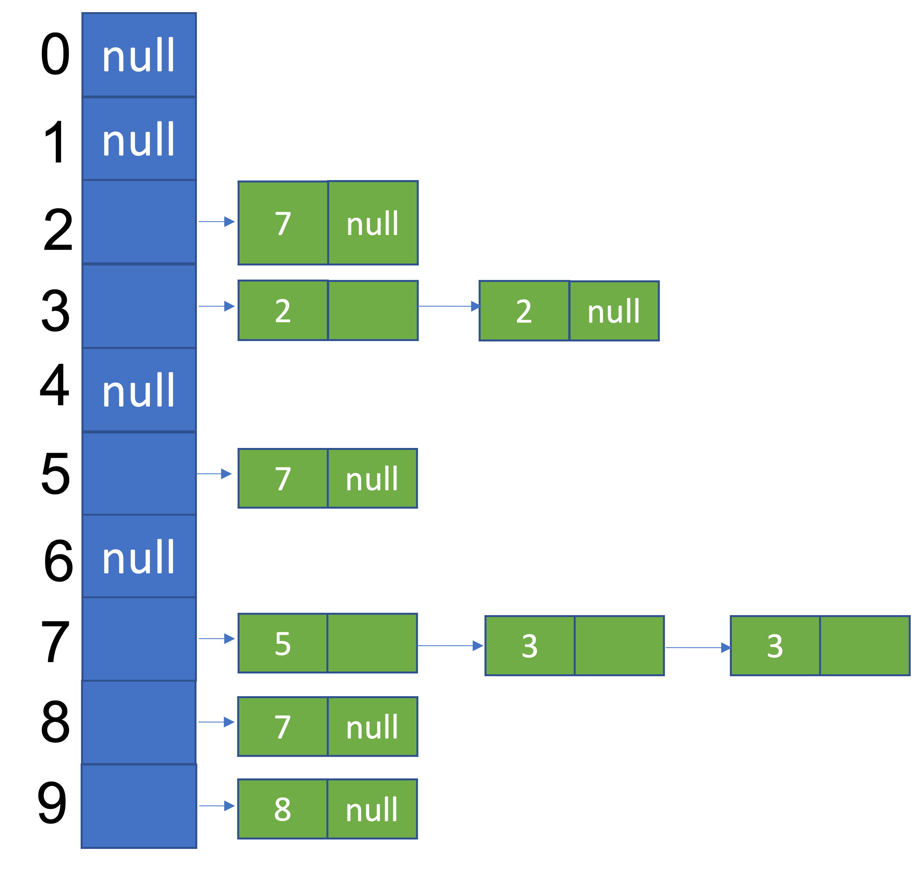
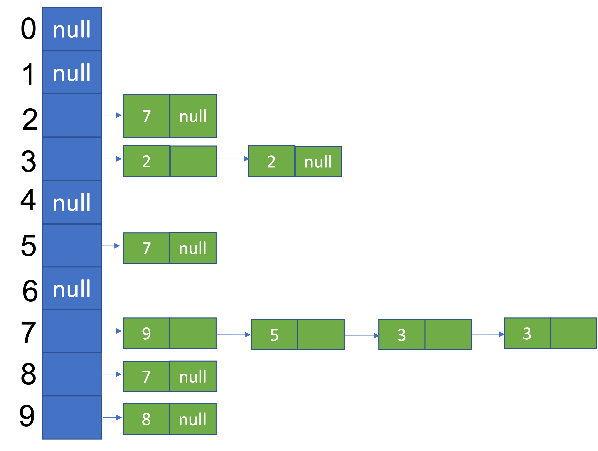

# CS 0445 – Algorithms and Data Structures 1 – Assignment#2 [^1]


## TABLE OF CONTENTS

- [Overview](#overview)
- [Details](#Details)

## OVERVIEW

**Purpose:** To emphasize the object-oriented programming approach used in Java, and to practice working with linked lists. Specifically, you will work with control structures, class-building, interfaces and generics to create and utilize a linked data structure `LinkedDS<T>` that will act as a data structure for sequences of Java Objects. Your `LinkedDS<T>` class will primarily implement the interface `SequenceInterface<T>`. The details of the interface are explained in the file SequenceInterface.java.


## Details

For the details on the functionality of your `LinkedDS<T>` class, carefully read over the files
`SequenceInterface.java` and `A2Test.java`. You must use these files as specified and **cannot remove/alter any of
the code that is already written in them**. There are different ways of implementing the
`SequenceInterface<T>` methods, some of which are more efficient than
others. Your implementation should meet the ruuning times specified in the method comments inside `SequenceInterface.java`. A lot of pencil and paper work is
recommended before actually starting to write your code. Your `LinkedDS<T>` class header should be:

`public class LinkedDS<T> implements SequenceInterface<T> {`


To illustrate how to store a sequence of objects as a one-dimensional array of linked lists, let's have an example.

Let's take the sequence `9875732732` as an example. This is a sequence of decimal digits. The sequence
alphabet is the set of possible values from which the sequence items are drawn. So, in this example the
alphabet is the set of decimal digits `{0, 1, 2, 3, 4, 5, 6, 7, 8, 9}`. This sequence can be represented using the following
diagram.



Each of the ten digits of the alphabet is represented by an entry in an array of `Node` objects. Each entry in the array is the head of a linked list that contains the successors of an item in the sequence, sorted by their position in the sequence in ascending order. In the example, the first two lists are empty because 0 and 1 are not in the sequence `9875732732`. The node in the linked list for 2 represents that digit 2 is followed by digit 7 only once in the sequence. The linked list for 7 contains three nodes, because 7 in its three occurrences in the sequence `9875732732` is followed by 5, 3, and 3, in that order. Every pair of consecutive items in the sequence results in a node in the diagram.

Here are some properties of the sequence in the example above. Please match these with the methods
in `SequenceInterface.java`.

```java
first() == 9
last() == 2
size() == 10
isEmpty() == false
getFrequencyOf(3) == 2
getFrequencyOf(2) == 2
getFrequencyOf(7, 3) == 2 //73 appeared twice in the sequence
successors(7) == {5, 3} //5 and 3 are the unique items that immediately follow 7 in the sequence
```

The example sequence after `push(7)`, which inserts 7 at the beginning of the sequence changing it to `79875732732`, will look like:



Note the insertion of the node containing 9 (the previous first item) at the beginning of the linked list for 7 (the new first item).

Here are some properties of the sequence after `push(7)`. Please match these with the methods
in `SequenceInterface.java`.

```java
first() == 7
last() == 2
size() == 11
isEmpty() == false
getFrequencyOf(3) == 2
getFrequencyOf(2) == 2
getFrequencyOf(7, 3) == 2 //73 appeared twice in the sequence
successors(7) == {9, 5, 3} //9, 5, and 3 are the unique items that immediately follow 7 in the sequence
```


